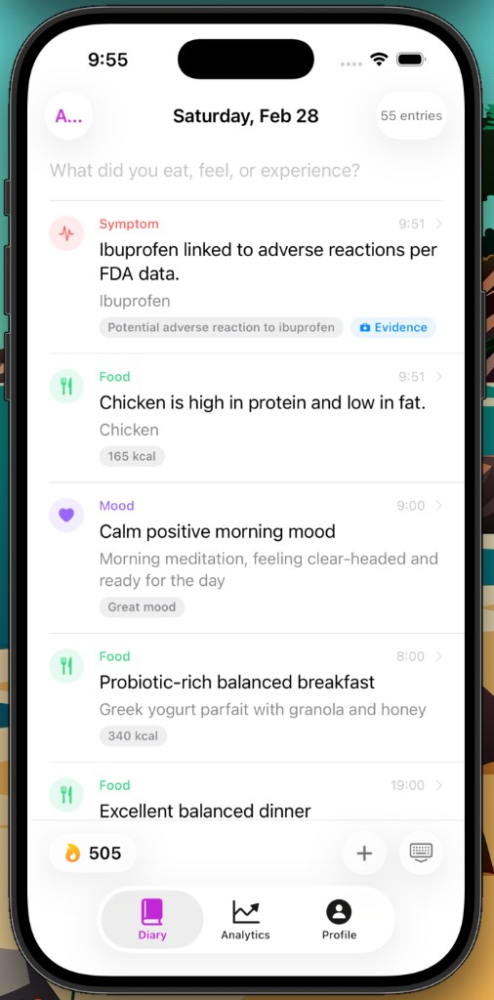
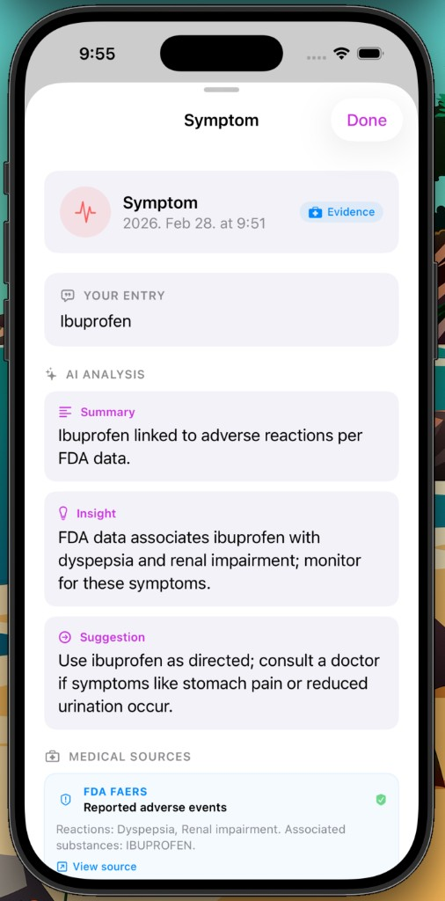
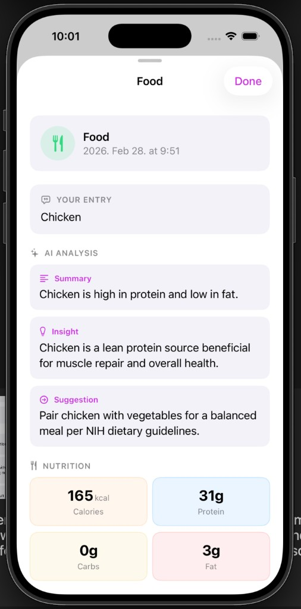
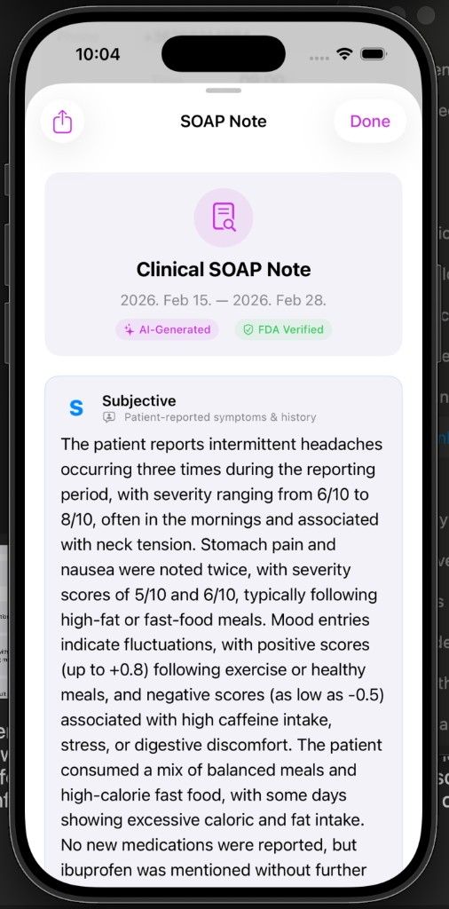
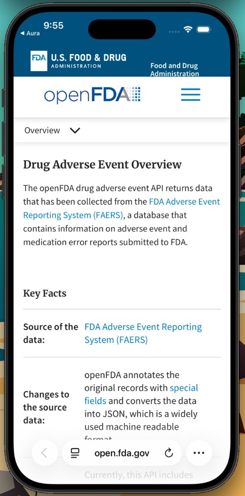
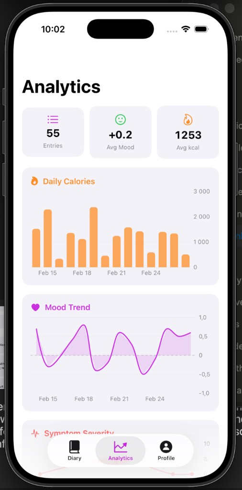
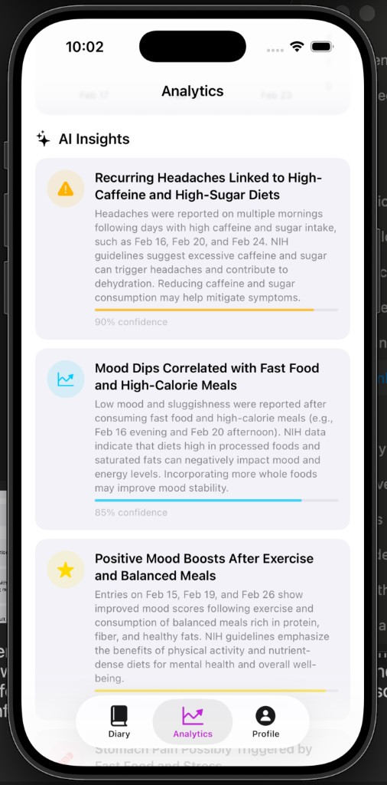
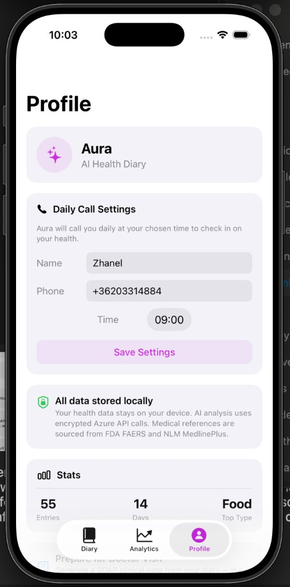
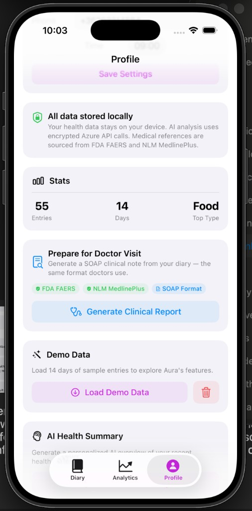

# Besh: Proactive AI Voice Triage for Post-AMI Care

## 60-Second Pitch

20% of post-heart attack patients are readmitted within 30 days.  
**Besh** is a proactive AI voice agent that calls patients, runs a 60-second clinical triage, and sends structured SOAP notes to doctors.  
**No app installs. No passwords. No friction.**

---

## Why We Built This

Most digital health tools assume patients will open an app every day and type how they feel. For many elderly post-AMI patients, that is not realistic.

The risky window is the first 30 days after discharge. We built Besh to close that gap with one simple behavior patients already understand: **answering a phone call**.



---

## What the Experience Looks Like

Patients can still log context when needed, but Besh is designed to actively collect the right follow-up data and avoid blank, unstructured entries.

- **Daily proactive outreach** instead of passive waiting
- **Targeted questions** based on prior symptoms
- **Structured clinical capture** ready for care teams




---

## Clinician-Focused Output

Doctors and care coordinators do not need another noisy dashboard. They need prioritized risk and concise clinical summaries.

- **Deterministic risk engine** flags Red / Yellow / Green from extracted facts
- **SOAP-ready summaries** for faster follow-up decisions
- **Source-backed evidence** to support trust and auditability




---

## Analytics and Trend Detection

Besh turns daily check-ins into useful longitudinal signals:

- calorie and lifestyle patterns
- mood trends
- recurring symptom triggers
- confidence-scored AI insights for coordinator review




---

## Profile and Care Operations

The care workflow stays simple: set daily call details, monitor data footprint, and generate clinical reports when needed.




---

## How We Built It

- **Telephony layer**: Twilio voice webhooks power phone calls
- **AI + parsing (Azure stack)**: Azure Speech-to-Text transcribes patient speech, then Azure OpenAI (GPT-4o) extracts structured JSON (symptoms, severity, medication adherence)
- **Backend**: Node.js + Express orchestrates APIs and runs deterministic risk rules
- **Frontend**: Vanilla JS + HTML transforms extracted data into readable clinical views

---

## Challenges We Faced

1. **Voice latency**: Twilio + Azure Speech + Azure OpenAI initially caused ~5s delay. Prompt optimization, tighter token limits, and streaming brought this under 2s.
2. **LLM boundaries**: Early versions drifted into advice. We hardened prompts so the model stays in extraction-only mode.
3. **Major pivot**: We started with a richer iOS diary concept, then pivoted to voice-first after recognizing the adoption gap for elderly patients.

## What We Are Proud Of

- **Zero-friction UX** for patients with low digital literacy
- **SaMD-aware architecture**: LLM for extraction, deterministic rules for risk
- **Reliable demo mode** for simulation without live API quota issues

## What We Learned

In healthcare, AI works best when bounded. LLMs are powerful for turning unstructured patient narratives into clean structured data, but clinical risk decisions must remain deterministic and auditable.

The best interface for a vulnerable patient is often **no interface at all**.

---

## Repository Structure

```text
.
├── ios/          # Legacy iOS prototype (pre-pivot)
├── screenshots/  # README images
└── web/          # Active voice triage backend + dashboard
```

## Quick Start (Web)

From `web/`:

```bash
pnpm install
pnpm dev
```

This starts the app via `server.js`.
